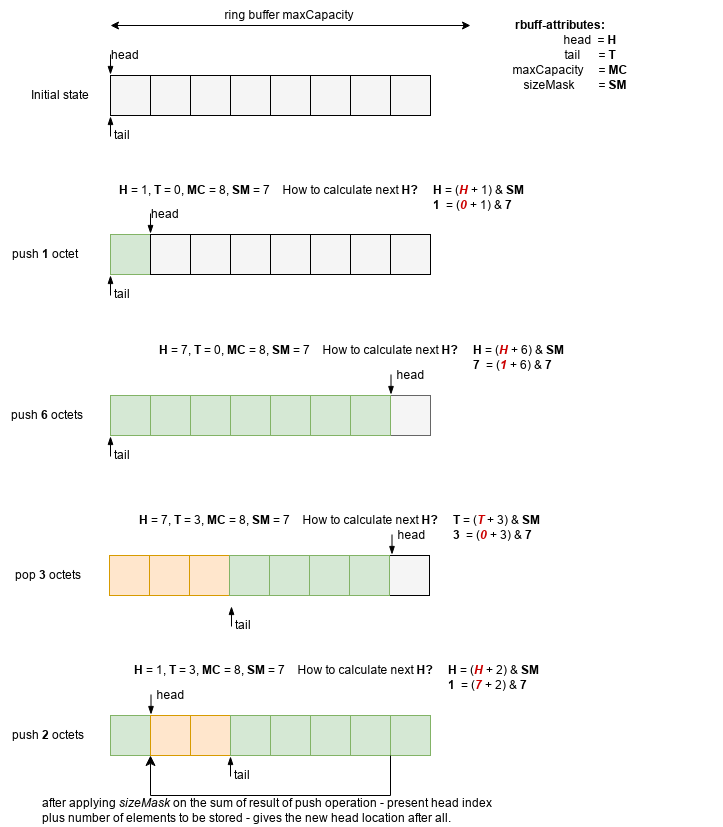

# Ring buffer implementation in C
-- *utilizing bit-mask to manage bound-checks on write operation*


## In bit level...

Buffer size is 2^N - N >= 3 - in this case 8 octets long. Maximum capacity is 8 octets.
**1st case**: push one ocetet into the buffer.
```
  MC = 8
  MS = 7
  H = 0
  T = 0

  Buffer: [X| | | | | | | ]
```
What happens here?
```
  new H = (H + number_of_bytes_to_store) & MS

     00000000  <- HEAD
  +  00000001  <- number of octets
----------------
     00000001

then

     00000001
AND  01111111
--------------
     00000001  
```
**2nd case**: pushing another 6 octets.
```
  MC = 8
  MS = 7
  H = 7
  T = 0

  Buffer: [X|X|X|X|X|X|X| ]
```
What happens here?
```
  new H = (H + number_of_bytes_to_store) & MS

     00000001
  +  00000110
----------------
     00000111

then

     00000111
AND  01111111
--------------
     00000111  
```
**3rd case**: Pop off 3 octets
```
  MC = 8
  MS = 7
  H = 7
  T = 3

  Buffer: [?|?|?|X|X|X|X| ]
```
What happens here?
```
  new T = (T + number_of_bytes_to_pop) & MS

     00000011 <- number of octets to pop off
  +  00000000 <- TAIL
----------------
     00000011

then

     00000111 
AND  01111111 <- MS
--------------
     00000111 <- new TAIL 
```
**4th case**: push 2 octets into buffer.

```
  MC = 8
  MS = 7
  H = 7
  T = 3

  Buffer: [X|?|?|X|X|X|X|X]
             ^   ^ TAIL
             | HEAD
```
What happens here?
```
  new H = (H + number_of_bytes_to_store) & MS

     00000010  <- number of octets to be stored
  +  00000111  < -HEAD
----------------
     00001001  <- new temporary HEAD

then

     00001001  <- temporary HEAD
AND  01111111  <- MS
--------------
     00000001  <- new HEAD
```
Pleas not that maximum *remaining* number of octets should be popped out!
Whic shall result of an empty buffer of course.
